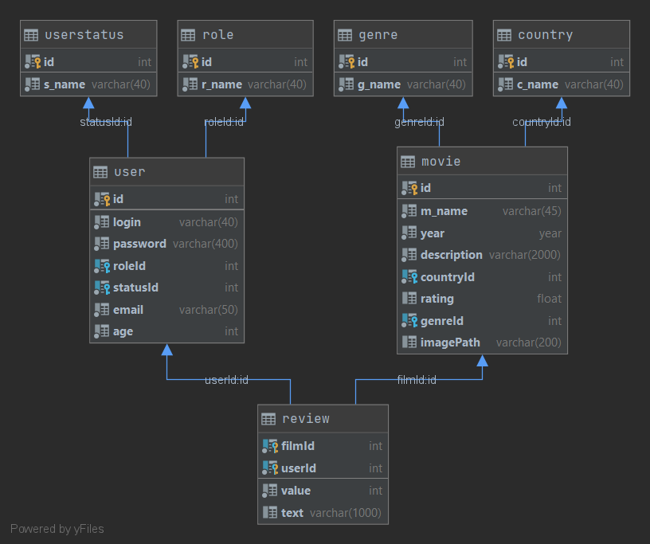

# epam_KinoLike
### EPAM Java Web Development
### final-project
Author: Dasha Zakhvey
## Description:
This platform is a film review application. Users can view movies by category, sort by rating or by release year. Authorized users can leave a review for the film. Additional functions for user and movie management are available to the administrator. The application calculates average ratings for films, and also downgrades or increases the status of the user, depending on his reviews.
## Functional:
#### Guest:
  + view List of films
  + view films by genre
  + view ordered by release year or rating list of films
  + sign in
  + sign up
#### Registered User:
  + view your profile with all your reviews
  + add review for film
  + sign out
  + functional for guest
#### Administrator:
  + view list of all registered users
  + change status of users
  + update information about film
  + delete film
  + add new film
  + all functional for registered user
---
## Database Diagram:

